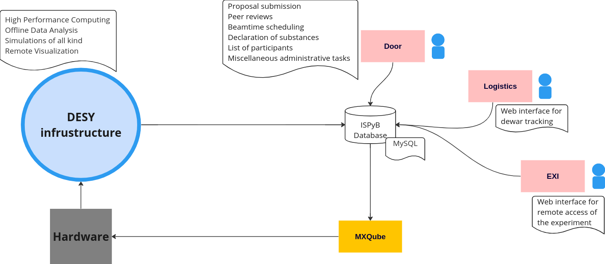

 # mxhub
Meta repo for MX related projects

## Modules

| Name | Platform | Repository |
|----------|-------|-----|
| ISPyB  | Java |
| EXI   | JavaScript | [GitHub](https://github.com/waltz-controls/mxhub-exi)
| Logistics   | Python |
| MXCuBe   | Python, Tango Controls |

